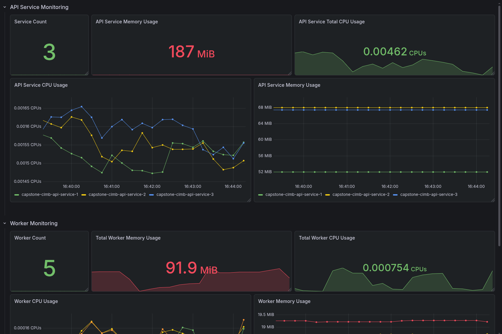
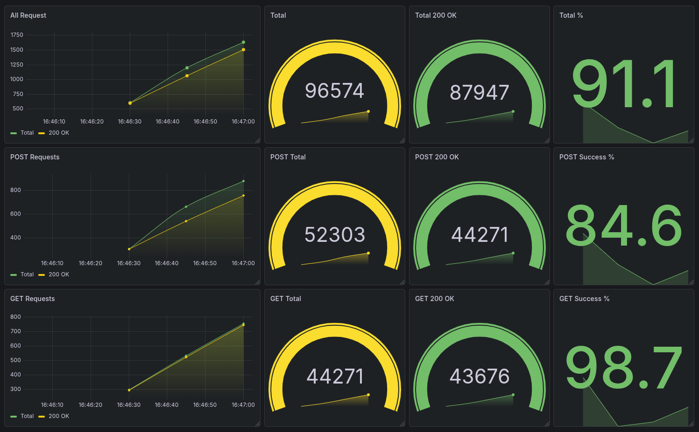

# Dashboard Grafana

Sistem menyediakan dua dashboard Grafana utama untuk memantau performa aplikasi dan hasil pengujian load testing secara real-time.

## Dashboard 1 - Container Resource Usage



Dashboard ini digunakan untuk memantau penggunaan resource seluruh container yang terlibat dalam sistem, baik API Service maupun Worker Service. Data diperoleh dari cAdvisor yang di-scrape oleh Prometheus.

### API Service Monitoring

#### Service Count

Menampilkan jumlah instance API Service yang sedang aktif.

Metric:

```promql
count(
  container_last_seen{
    container_label_com_docker_compose_service="api-service"
  }
)
```

Fungsi:

* Memastikan seluruh replica API berjalan.
* Memverifikasi hasil horizontal scaling.

---

#### API Service Total Memory Usage

Menampilkan total penggunaan memori seluruh instance API Service.

Metric:

```promql
sum(
  container_memory_usage_bytes{
    container_label_com_docker_compose_service="api-service"
  }
)
```

Fungsi:

* Mengukur konsumsi memori keseluruhan aplikasi.
* Mengidentifikasi kemungkinan memory leak.

---

#### API Service Total CPU Usage

Menampilkan total penggunaan CPU seluruh instance API Service.

Metric:

```promql
sum(
  rate(
    container_cpu_usage_seconds_total{
      container_label_com_docker_compose_service="api-service"
    }[1m]
  )
)
```

Fungsi:

* Mengetahui beban pemrosesan API.
* Membandingkan penggunaan CPU sebelum dan saat peak load.

---

#### API Service CPU Usage

Menampilkan penggunaan CPU masing-masing container API Service secara real-time.

Metric:

```promql
rate(container_cpu_usage_seconds_total{
  container_label_com_docker_compose_service="api-service"
}[1m])
```

Fungsi:

* Mengidentifikasi replica yang menerima beban lebih tinggi.
* Memverifikasi distribusi beban oleh Nginx Load Balancer.

---

#### API Service Memory Usage

Menampilkan penggunaan memori setiap container API Service.

Metric:

```promql
container_memory_usage_bytes{
  container_label_com_docker_compose_service="api-service"
}
```

Fungsi:

* Memantau konsumsi RAM tiap replica.
* Mengidentifikasi ketidakseimbangan penggunaan resource.

---

### Worker Monitoring

#### Worker Count

Menampilkan jumlah worker yang aktif.

Metric:

```promql
count(
  container_last_seen{
    container_label_com_docker_compose_service="worker-service"
  }
)
```

Fungsi:

* Memastikan seluruh worker berjalan.
* Memverifikasi mekanisme scaling worker.

---

#### Total Worker Memory Usage

Menampilkan total penggunaan memori seluruh worker.

Metric:

```promql
sum(
  container_memory_usage_bytes{
    container_label_com_docker_compose_service="worker-service"
  }
)
```

Fungsi:

* Mengetahui total kebutuhan RAM sistem pemrosesan transaksi.

---

#### Total Worker CPU Usage

Menampilkan total penggunaan CPU seluruh worker.

Metric:

```promql
sum(
  rate(
    container_cpu_usage_seconds_total{
      container_label_com_docker_compose_service="worker-service"
    }[1m]
  )
)
```

Fungsi:

* Mengukur beban pemrosesan transaksi di backend.

---

#### Worker CPU Usage

Menampilkan penggunaan CPU masing-masing worker.

Metric:

```promql
rate(container_cpu_usage_seconds_total{
  container_label_com_docker_compose_service="worker-service"
}[1m])
```

Fungsi:

* Mengidentifikasi worker yang mengalami bottleneck.
* Melihat distribusi beban antar worker.

---

#### Worker Memory Usage

Menampilkan penggunaan memori setiap worker secara individual.

Metric:

```promql
container_memory_usage_bytes{
  container_label_com_docker_compose_service="worker-service"
}
```

Fungsi:

* Memantau stabilitas worker selama peak load.
* Mengidentifikasi worker yang mengalami konsumsi memori berlebih.

---

## Dashboard 2 - K6 Monitoring



Dashboard ini digunakan untuk memonitor performa sistem selama proses load testing menggunakan K6.

### Konfigurasi K6 Metrics

Agar metrik K6 dapat dikirim ke Prometheus dan ditampilkan pada Grafana, jalankan script K6 menggunakan Prometheus Remote Write:

```bash
k6 run \
--out experimental-prometheus-rw=http://localhost:9090/api/v1/write \
load-test/peak_load_test.js
```

Contoh lain:

```bash
k6 run \
--out experimental-prometheus-rw=http://localhost:9090/api/v1/write \
load-test/baseline.js
```

```bash
k6 run \
--out experimental-prometheus-rw=http://localhost:9090/api/v1/write \
load-test/k6-benchmark.js
```

Tanpa parameter tersebut, dashboard Grafana tidak akan menerima metrik K6 secara real-time.

---

### All Request

Menampilkan throughput seluruh request yang dikirim K6.

Metric:

```promql
sum(rate(k6_http_reqs_total[1m]))
```

Dilengkapi dengan kurva:

```promql
sum(rate(k6_http_reqs_total{status="200"}[1m]))
```

untuk membandingkan total request dan request sukses.

---

### Total Request

Menampilkan jumlah seluruh request yang telah dikirim selama pengujian.

Metric:

```promql
sum(k6_http_reqs_total)
```

---

### Total 200 OK

Menampilkan total request yang berhasil diproses.

Metric:

```promql
sum(k6_http_reqs_total{status="200"})
```

---

### Total Success %

Menampilkan persentase keberhasilan seluruh request.

Metric:

```promql
sum(k6_http_reqs_total{status="200"})
/
sum(k6_http_reqs_total)
* 100
```

Fungsi:

* Menjadi indikator utama stabilitas sistem selama pengujian.

---

### POST Requests

Menampilkan throughput endpoint transaksi.

Metric:

```promql
sum(rate(k6_http_reqs_total{url="POST /transaction"}[1m]))
```

dan

```promql
sum(rate(k6_http_reqs_total{
  url="POST /transaction",
  status="200"
}[1m]))
```

Fungsi:

* Mengukur kemampuan sistem menerima transaksi baru.

---

### POST Total

Menampilkan total request transaksi.

Metric:

```promql
sum(k6_http_reqs_total{
  url="POST /transaction"
})
```

---

### POST 200 OK

Menampilkan jumlah transaksi yang berhasil diterima.

Metric:

```promql
sum(k6_http_reqs_total{
  status="200",
  url="POST /transaction"
})
```

---

### POST Success %

Menampilkan tingkat keberhasilan endpoint transaksi.

Metric:

```promql
sum(k6_http_reqs_total{
  status="200",
  url="POST /transaction"
})
/
sum(k6_http_reqs_total{
  url="POST /transaction"
})
*100
```

---

### GET Requests

Menampilkan throughput endpoint inquiry.

Metric:

```promql
sum(rate(k6_http_reqs_total{
  url="GET /inquiry"
}[1m]))
```

dan

```promql
sum(rate(k6_http_reqs_total{
  url="GET /inquiry",
  status="200"
}[1m]))
```

Fungsi:

* Mengukur kemampuan sistem melayani pengecekan status transaksi.

---

### GET Total

Menampilkan total request inquiry.

Metric:

```promql
sum(k6_http_reqs_total{
  url="GET /inquiry"
})
```

---

### GET 200 OK

Menampilkan total inquiry yang berhasil.

Metric:

```promql
sum(k6_http_reqs_total{
  status="200",
  url="GET /inquiry"
})
```

---

### GET Success %

Menampilkan tingkat keberhasilan endpoint inquiry.

Metric:

```promql
sum(k6_http_reqs_total{
  status="200",
  url="GET /inquiry"
})
/
sum(k6_http_reqs_total{
  url="GET /inquiry"
})
*100
```

---